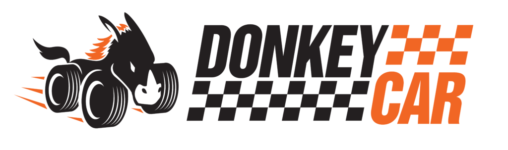
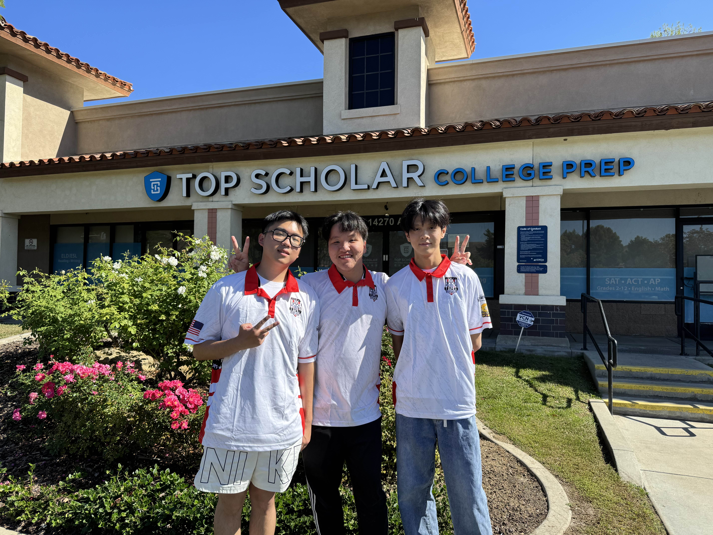
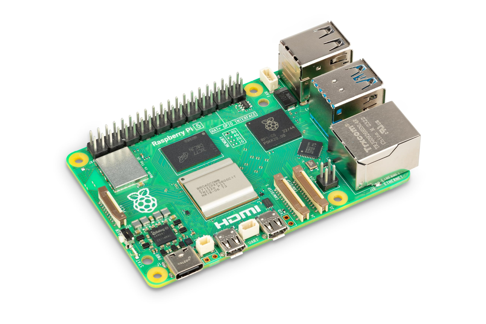
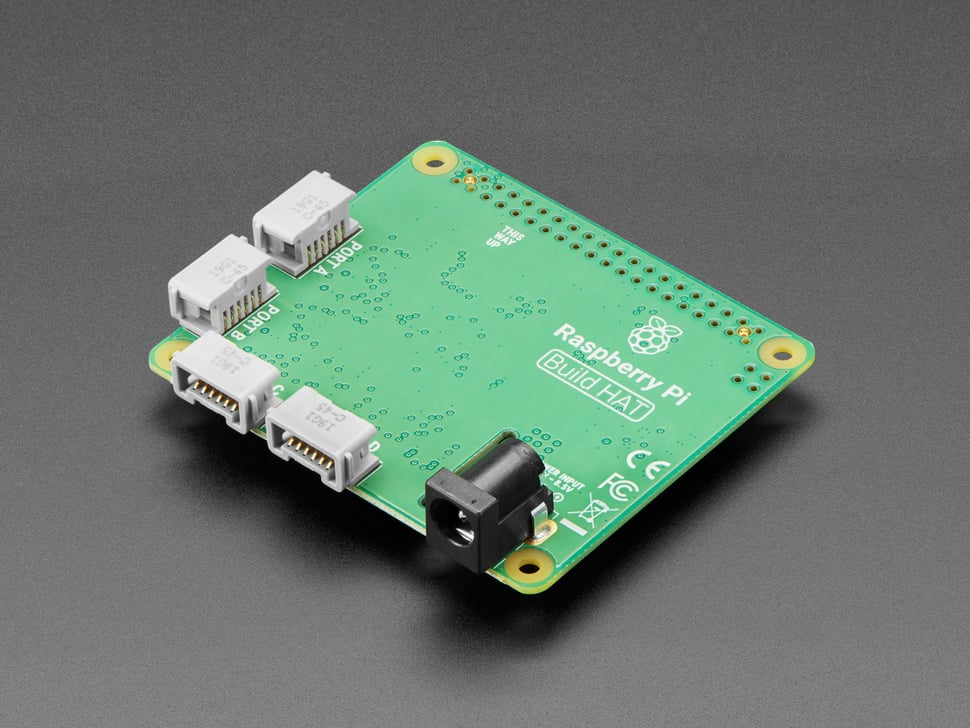
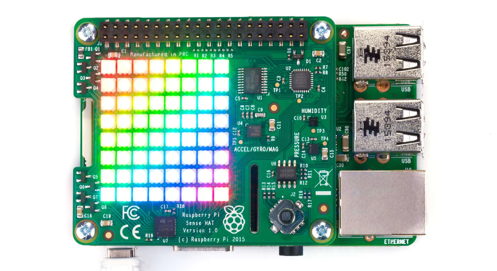
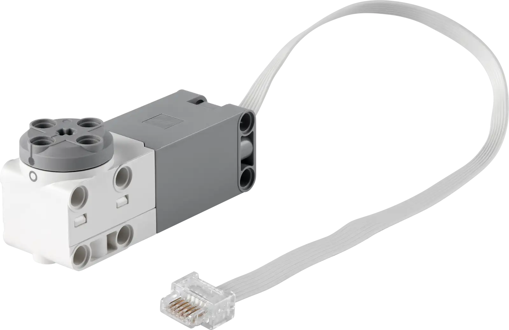
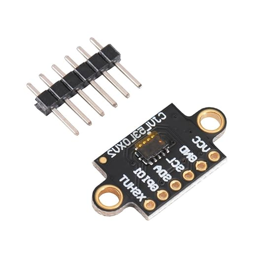

<h1 align="center">WRO 2025 Future Engineers</h1>   
<h2 align="center">Top Scholar Engineers</h2>
<h3 align="center">Autonomous Driving Project</h3>

<div align="center">

**US National Champions (July 2025)**  
**World Finals Competitors (November 2025)**  
**Last Updated: November 2025**


</div>
<p align="center">
  
</p>
</div>


### Robot Overview


---

### Detailed Views

| Front | Back |
|:---:|:---:|
|  |  |

| Left | Right |
|:---:|:---:|
|  |  |

| Top View |
|:---:|
|  |

</div>
---

## Table of Contents
1. [Project Overview](#project-overview)
2. [Competition Videos](#competition-videos)
3. [The Team](#the-team)
4. [The Robot](#the-robot)
5. [Evolution: V1.0 → V2.0](#evolution-v10--v20)
6. [Hardware Architecture (V2.0)](#hardware-architecture-v20)
   - [Computing & Control](#computing--control)
   - [Mobility System](#mobility-system)
   - [Power System](#power-system)
   - [Sensor Suite](#sensor-suite)
7. [Software Architecture](#software-architecture)
   - [Software Stack](#software-stack)
   - [Code Structure](#code-structure)
   - [Key Components](#key-components)
   - [Code Examples](#code-examples)
8. [Training Pipeline](#training-pipeline)
9. [Competition Strategy](#competition-strategy)
   - [Open Challenge (Free Run)](#open-challenge-free-run)
   - [Obstacle Challenge](#obstacle-challenge)
10. [Technical Deep Dive](#technical-deep-dive)
11. [Problem-Solving Journey](#problem-solving-journey)
12. [Lessons Learned](#lessons-learned)
13. [Future Improvements](#future-improvements)
14. [Resources](#resources)
15. [License](#license)
16. [Citation](#citation)

---

## Project Overview

This project is developed for the **WRO 2025 Future Engineers** competition. Built on the open-source [DonkeyCar](https://docs.donkeycar.com/) platform and powered by **TensorFlow**, our autonomous vehicle evolved from a simple RC car into an intelligent agent capable of real-time decision-making.   
<div align="center">
  
  
</div>

**Core Approach:**  
<table>
  <tr>
    <td width="60%">
      
      <p align="center"><i>Image from Donkeycar Documentation</i></p>
    </td>
    <td width="40%" valign="top">
      We use <b>Behavior Cloning</b> — the AI learns from human driving examples. A camera captures images while we manually drive, recording steering angles and throttle values. The trained CNN model then predicts control signals during autonomous operation, converting them to motor commands via the Raspberry Pi Build HAT.
    </td>
  </tr>
</table>

<div align="center">
  <h1>⚡ Philosophy Shift ⚡</h1>
  <h2>After winning the US National Championship with V1.0,<br>we <b>completely redesigned</b> the system for the World Finals</h2>
  <h2> <b>Stability over Speed</b> </h2>
  <h3>V2.0 prioritizes reliability, precision control, and comprehensive environmental awareness</h3>
</div>


---

## Competition Videos

- Competition Run: https://youtu.be/cEDCCi7XaPo?si=7d81ayKwttVvmEN5](https://youtu.be/cEDCCi7XaPo?si=UrSpBroxmGeDPVLr


---

## The Team


**Zhengyi Jin:** 

- School: Chino Hills High School 
- Background: Passionate about AI robotics and aiming to purse computer engineering and artificial intelligence in the future,skilled in Python and Java, specializing in AI-based control systems and autonomous driving algorithms.

**Zhenshen Yi:** 

- School: Ruben S. Ayala High School
- Background: Skilled in Python and C++, with experience in OpenCV-based object tracking and Rasberry Pi control. Previously completed in VEX Robotics and handled programming for autonomous mode.

**Victor Zhang:**

- School:Army and Navy Academy
- Background: Completed in WRO 2024 Robot Mission, gaining experience in progamming, robot calibration and strategic task execution. Skilled in teamwork and documentation for competition preparation.

**Coach- Fei Guo:** 

- Guided multiple student teams in robotics competitions, including WRO Robot Mission and Future Engineers categories.
- Experienced STEM and robotics educator with a strong focus on project-based earning and interdisciplinary innovation.
- Focus on culticating both technical competence and leadership skills in students, preparing them for future innovation chanllenges

**Team Name:** Top Scholars  
**Competition:** WRO 2025 Future Engineers  
**Location:** Chino Hills, California, USA

---

## The Robot

**Design Philosophy:**  
Stability-first autonomous vehicle with 360° environmental awareness, precision motor control, and advanced sensor fusion.

**Key Features:**
- ✅ Closed-loop LEGO motor control with encoder feedback
- ✅ 4-directional ToF sensing (front/right/back/left)
- ✅ Advanced gyro drift correction (<2°/minute)
- ✅ Full bidirectional navigation capability
- ✅ AI-powered obstacle avoidance + deterministic parking


---

---

## Evolution: V1.0 → V2.0

After winning the **US National Championship in July 2025**, we completely redesigned our vehicle for the **World Finals in Singapore (November 2025)**. The philosophy shifted from **speed-first to stability-first**, addressing critical issues from the national competition.

### Major Changes Summary

| Aspect | V1.0 (Nationals) | V2.0 (World Finals) ⭐ |
|--------|-----------------|----------------------|
| **Controller** | Raspberry Pi 4 | Raspberry Pi 5 + Build HAT |
| **Drive Motors** | 1× RC brushed motor (PWM) | 2× LEGO Technic Medium Angular Motors |
| **Steering** | 1× RC servo (PWM) | 1× LEGO Medium Angular Motor |
| **Heading Sensor** | WT901 gyroscope | Sense HAT IMU (300Hz) |
| **Distance Sensors** | 1× front ToF | 4× VL53L0X ToF (360° coverage) |
| **Max Speed** | 50-70% throttle | 25-40% throttle |
| **Heading Drift** | >10°/minute | <2°/minute |
| **Reverse Capability** | ❌ None | ✅ Full bidirectional |
| **Control Method** | Open-loop PWM | Closed-loop encoder feedback |
| **Training Dataset** | ~150,000 frames | ~200,000 frames |
| **Obstacle Variations** | Every 8-10 runs | Every 4-5 runs |

### V1.0 System (US National Championship)

<details>
<summary><b>Click to expand V1.0 details</b></summary>

**Core Components:**
- Raspberry Pi 4 - Central computing unit
- RC Brushed Motor + ESC - Drive system with PWM control  
  

- RC Servo - Steering via PCA9685 PWM driver  
  
- PiCamera - Vision input for AI model  
  
- WT901 Gyroscope - Heading estimation  
  
- Color Sensor - Blue line detection
- Wireless PS4 Controller - Manual control during training  
  

**Design Philosophy:**
- Maximum speed for fastest lap times (50-70% throttle)
- Single-direction sensing (front only)
- PWM-based control without position feedback

**V1.0 Challenges:**
- ❌ Gyroscope drift caused premature stops (>10°/min)
- ❌ High-speed crashes due to limited reaction time
- ❌ No reverse capability for parking challenge
- ❌ Open-loop control led to inconsistent steering angles

</details>

### Key Innovations in V2.0

1. **✅ 360° Sensing Capability**  
   Four VL53L0X ToF sensors provide complete environmental awareness (front/right/back/left)

2. **✅ Advanced Heading Estimation**  
   300Hz gyroscope integration with ZUPT (Zero Velocity Update) and magnetic correction

3. **✅ Reverse Driving Capability**  
   Full bidirectional navigation enables complex parking maneuvers

4. **✅ Retrained AI Models**  
   New datasets optimized for stable, slower driving (4 models: FCW/FCCW/OCW/OCCW)

5. **✅ Precise Motor Control**  
   LEGO encoder feedback eliminates guesswork with ±1° steering precision

---

## Hardware Architecture (V2.0)

### Computing & Control

#### Raspberry Pi 5
<table>
<tr>
<td width="300">

</td>
<td>

- **Model:** Raspberry Pi 5 RAM 8GB
- **Operating System:** Raspberry Pi OS (Bookworm)
- **CPU:** Broadcom BCM2712
- **RAM:** 8GB
- **Role:** Main controller running software stack, AI inference, sensor fusion
- **Interfaces Used:**
  - CSI: PiCamera
  - GPIO: Build HAT communication, ToF XSHUT pins
  - I2C: ToF sensors
  - USB-C: Power input

</td>
</tr>
</table>

#### Raspberry Pi Build HAT
<table>
<tr>
<td>

#### Raspberry Pi Build HAT
- **Model:** Raspberry Pi Build HAT
- **Function:** Direct LEGO motor control with encoder feedback
- **Specifications:**
  - Motor Ports: 4 (A, B, C, D)
  - Input Voltage: 7.5-9V DC
  - Control Method: Closed-loop with built-in encoder reading
  - Communication: Via GPIO pins to Raspberry Pi
- **Python Library:** `buildhat` (official)
- **Non-blocking Control:** Enables simultaneous steering + driving

</td>
<td width="300">

</td>
</tr>
</table>

#### Sense HAT
<table>
<tr>
<td>

#### Sense HAT
- **Model:** Sense HAT 
- **Sensors Used:**
  - **IMU:** Gyroscope + Accelerometer + Magnetometer (optional)
  - **Joystick:** 5-direction input for model selection
  - **LED Matrix:** Status display (8×8)

</td>
<td width="300">

</td>
</tr>
</table>


---

### Mobility System

#### Drivetrain

**Configuration:** Rear-wheel drive with synchronized dual motors

**Motors:** 2× LEGO  Medium Angular Motors
<table>
<tr>
<td>

#### LEGO Medium Angular Motor
- **Ports:** A & B & C (Build HAT)
- **Control:** Coupled via `MotorPair` class
- **Model:** 88018 (LEGO Item Number: 6386708)   
- **Specifications:**
  - Max RPM: 185 RPM ±15%
  - Torque: 3.5 N·cm @ 135 RPM ±15% MAX
  - Encoder Resolution: 360 counts per revolution   
- **Software Speed:** 30% max (competition setting, configurable to 100%)
- **Quantization:** 10% speed steps (code rounds to nearest 10)
- **Stop Behavior:** Active brake (not coast)

</td>
<td width="300">

</td>
</tr>
</table>
**Physical Connection:**
Motors are physically connected via LEGO gearbox system (compliant with WRO rule 11.3)


**Control Flow:**
```
Model Output (-1.0 to +1.0) 
  → × angle_offset (0.7)
  → Map to ±70° range
  → Quantize to nearest 10°
  → Send to Build HAT motor
```

#### Chassis

**Construction:** Full LEGO Technic  
**Materials:** LEGO beams, pins, axles (no 3D printed parts in V2.0)

**Design Features:**
- Modular assembly for easy maintenance
- Low center of gravity for stability
- Quick-swap battery access

---

### Power System

#### Primary Battery: 2× 7.4V LiPo

<table>
<tr>
<td width="300">

</td>
<td>

#### Battery
- **Type:** Lithium Polymer (LiPo)
- **Voltage:** 7.4V (2S configuration)
- **Powers:** Build HAT (7.5-9V input requirement)
  - Motors draw current through Build HAT

</td>
</tr>
</table>

#### Auxiliary Power: USB Power Bank

- **Type:** USB Power Bank
- **Output:** 5V / 3A (USB-C)
- **Powers:** Raspberry Pi 5 only


#### Power Distribution Diagram
```
┌─────────────────────────────────────────────┐
│         7.4V LiPo Battery (×2)              │
└──────────────┬──────────────────────────────┘
               │
               ▼
       ┌───────────────┐
       │  Build HAT    │ (7.5-9V input)
       └───────┬───────┘
               │
      ┌────────┴────────┐
      ▼                 ▼
  Motor B & C       Motor A
 (Drive, Port B/C)  (Steer, Port A)


┌─────────────────────────────────────────────┐
│         USB Power Bank                      │
└──────────────┬──────────────────────────────┘
               │ (USB-C, 5V/3A)
               ▼
       ┌───────────────┐
       │ Raspberry Pi 5│
       └───────┬───────┘
               │
      ┌────────┴────────────┐
      ▼                     ▼
  Sense HAT             PiCamera
  (GPIO pins)           (CSI port)
```

**Voltage Regulation:**
- Build HAT requires 7.5-9V → supplied directly by 7.4V LiPo (in range)
- Raspberry Pi 5 requires 5V → supplied by USB-C power bank
- Sensors (ToF, Color Sensor) powered by Pi's 3.3V/5V GPIO rails


---

### Sensor Suite

#### Vision: PiCamera


<table>
<tr>
<td width="300">

</td>
<td>

#### Camera Module
- **Model:** 8MP IMX219 175 Degree Ultra Wide Angle Raspberry Pi Camera Module
- **Interface:** CSI (Camera Serial Interface)
- **Resolution:**
  - Capture: 176 × 132 pixels
  - Model Input: 160 × 120 pixels (center-cropped)
- **Frame Rate:** 30 FPS
- **Fixed Parameters** (critical for consistent training/deployment):
```python
CAMERA_FRAMERATE = 30
PICAMERA_AWB_MODE = 'off'           # No auto white balance
PICAMERA_EXPOSURE_MODE = 'off'       # Manual exposure
PICAMERA_ISO = 100
PICAMERA_SHUTTER_SPEED = 15000       # µs (≈ 1/67 second)
PICAMERA_AWB_GAINS = (1.5, 1.2)      # Manual red/blue gains
PICAMERA_EXPOSURE_COMPENSATION = 0
```
- **Why Manual Settings?**  
  Prevents camera from adapting to lighting changes during competition, ensuring model sees consistent images

</td>
</tr>
</table>
#### Distance: 4× VL53L0X ToF Sensors
<table>
<tr>
<td width="300">

</td>
<td>

#### VL53L0X Time-of-Flight Sensor   

   
- **Model:** VL53L0X Time-of-Flight (laser ranging)
- **Manufacturer:** STMicroelectronics
- **Specifications:**
  - Range: 30mm - 2000mm
  - Accuracy: ±3% (up to 1200mm)
  - Field of View: 25°
  - Measurement Time: ~30ms (Better Accuracy Mode)
- **I2C Communication:**
  - Default Address: 0x29 (all 4 sensors)
  - Reassigned Addresses via XSHUT pins:
    - **Front:** 0x2A (XSHUT on GPIO 21)
    - **Right:** 0x2B (XSHUT on GPIO 27)
    - **Back:** 0x2C (XSHUT on GPIO 22)
    - **Left:** 0x2D (XSHUT on GPIO 26)
- **Initialization Sequence:**
```python
# Power off all sensors
for pin in [21, 27, 22, 26]:
    GPIO.output(pin, GPIO.LOW)

# Power on one-by-one, assign unique addresses
for pin, addr in zip([21, 27, 22, 26], [0x2A, 0x2B, 0x2C, 0x2D]):
    GPIO.output(pin, GPIO.HIGH)
    sensor.set_address(addr)
```
- **Filtering:** EWMA (Exponential Weighted Moving Average)
  - Formula: `filtered = 0.3 × old + 0.7 × new`
  - Purpose: Reduce noise while maintaining responsiveness
- **Applications:**
  - **Forward:** Front sensor monitors obstacles ahead
  - **Reverse:** Back sensor takes over during parking
  - **Lateral:** Right sensor detects parking lot boundaries
  - **Emergency Stop:** Any sensor <100mm triggers immediate stop

</td>
</tr>
</table>


#### Heading: Sense HAT IMU

<table>
<tr>
<td width="300">

</td>
<td>

#### Sense HAT IMU
- **Components Used:**
  - Gyroscope (primary)
  - Accelerometer (for ZUPT - Zero Velocity Update)
  - Magnetometer (optional, disabled during motion)
- **Sampling Rate:** 300 Hz (in `HeadingEstimator` thread)
- **Calibration:**
  - 5-second stationary period on startup
  - Collects gyro samples only when vehicle is still (accelerometer check)
  - Robust estimation: Median + MAD (Median Absolute Deviation)
- **Drift Correction:**
  - **ZUPT:** Bias slowly updated when stationary (γ=0.002)
  - **Magnetic Correction:**
    - During Motion: α=0.0 (pure gyro, no compass interference)
    - When Stationary: α=0.008 (gentle pull toward magnetic north)
- **Performance:** <2°/minute drift (vs >10°/min in V1.0)
- **Output:** Continuous heading in degrees (can exceed ±360°)

</td>
</tr>
</table>

---


## Software Architecture

### Software Stack

| Component | Version / Details |
|-----------|-------------------|
| **Operating System** | Raspberry Pi OS (Bookworm) - Linux-based |
| **ML Framework** | TensorFlow 2.x (CPU inference on Pi 5) |
| **Training Platform** | DonkeyCar v4.5.0.2|
| **Motor Control** | Build HAT Python Library (official) |
| **Vision** | OpenCV 4.x, picamera2 |
| **Language** | Python 3.11 |

### Code Structure
```
projectbuildhat/
├── Iman_drive03.py                    # Main competition autonomous code
├── gyro_motor_tof_v_07.py             # Core navigation functions (gyro_run, gyro_turn)
├── VL53L0X_test16.py                  # ToF sensor testing script
├── manage.py                          # DonkeyCar entry point (training/driving)
├── train.py                           # CNN model training script
├── _Control_RCcar_with_KB.py          # Keyboard manual control test
├── 01_detect_GPIO.py                  # GPIO functionality check
├── 09_readGyro_whth_continueDATA.py   # Gyroscope testing
├── Adafruit_LCD1602.py                # LCD display test
├── mycar/                             # DonkeyCar project folder
│   ├── config.py                      # Camera/training settings
│   └── data/                          # Collected tub datasets
└── models/
    ├── fcwm008/                       # Free run Clockwise model
    │   └── mypilot.h5
    ├── fccwm007/                      # Free run Counter-clockwise
    │   └── mypilot.h5
    ├── obstacleruncwmodels50nat/      # Obstacle Clockwise
    │   └── mypilot.h5
    └── occwm001-010/                  # Obstacle Counter-clockwise
        └── mypilot.h5
```

### Key Components

#### 1. `HeadingEstimator` Class (gyro_motor_tof_v_07.py)

**Purpose:** High-frequency IMU processing for accurate heading tracking

**Features:**
- 300 Hz sampling rate (15× faster than V1.0's ~20 Hz)
- Initial 5-second calibration (stationary only, robust statistics)
- ZUPT (Zero Velocity Update) drift correction
- Dynamic magnetic correction (motion-adaptive)

**Key Methods:**
```python
class HeadingEstimator:
    def __init__(self, sense, use_compass=True):
        # Initialize IMU, start calibration thread
        
    def zero(self):
        # Set current heading as 0° reference
        
    def get(self):
        # Return current heading relative to zero point
        
    def is_ready(self):
        # Check if calibration complete
```

**Algorithm (Simplified):**
```python
# Initial bias calibration (5 seconds)
while time < 5.0:
    if is_stationary(accel, gyro):
        samples.append(gyro_z)
bias_z = robust_estimate(samples)  # median + MAD

# Main loop at 300 Hz
while running:
    yaw_increment = (gyro_z - bias_z) * dt
    yaw_deg += yaw_increment
    
    if stationary:
        bias_z = (1-γ) * bias_z + γ * gyro_z  # ZUPT
        if use_compass:
            yaw_deg = (1-α) * yaw_deg + α * compass_heading  # Gentle correction
```

#### 2. `LegoSteering` Class (Iman_drive03.py)

**Purpose:** Control front-wheel steering motor on Build HAT Port A

**Key Parameters:**
- Physical Range: ±70° (set in `__init__`)
- Software Limit: ±50° (in `gyro_motor_tof_v_07.py`)
- Speed: 100 steps/sec
- Angle Offset: 0.7× (compensates for mechanical/AI model characteristics)

**Logic:**
```python
class LegoSteering:
    def run(self, angle: float):  # angle from -1.0 to +1.0
        angle = angle * angle_offset  # Apply 0.7× scaling
        angle = max(min(angle, 1.0), -1.0)  # Clamp
        raw = self.left + (angle + 1) * (self.right - self.left) / 2
        pos = int(round(raw / 10) * 10)  # Quantize to 10° steps
        
        # Different behaviors for small vs large angles
        if -40 <= pos <= 40:
            self.motor.run_to_position(pos, speed=100, blocking=False)
        else:
            self.motor.start(speed=int(angle * STEERING_MAX_SPEED))
```

#### 3. `LegoThrottle` Class (Iman_drive03.py)

**Purpose:** Control rear drive motors (MotorPair on Ports B & C)

**Key Parameters:**
- Max Speed: 30% (competition setting, `MAX_SPEED_PERCENT`)
- Quantization: 10% steps
- Stop Action: Active brake

**Logic:**
```python
class LegoThrottle:
    def run(self, throttle: float):  # -1.0 to +1.0
        throttle = max(min(throttle, 1.0), -1.0)
        speed = int(throttle * self.max_speed)
        speed = int(round(speed / 10.0) * 10)  # Quantize
        
        if speed == 0:
            self._stop()  # Brake
        elif speed != self.last_speed:
            self.ml.start(speed=speed)
            self.mr.start(speed=speed)
```

#### 4. `ColorLineCounterThreaded` Class (Iman_drive03.py)

**Purpose:** Detect blue starting line and orange markers in background thread

**Algorithm:**
- **Dynamic Baseline:** EMA on intensity (`I_base`)
- **Blue Detection:** Darkness-based with hysteresis
  - Enter: `i_rel < 0.78`
  - Hold: `i_rel < 0.85`
- **Orange Detection:** Red dominance + brightness
  - `r_n - max(g_n, b_n) > 0.18` AND `i_rel >= 0.85`
- **Debounce:**
  - Minimum hold: 30ms
  - Minimum gap: 80ms

#### 5. Model Selection (Iman_drive03.py)

**Method:** Sense HAT joystick navigation on startup
```python
# Joystick directions:
LEFT  → FCW  (Free run Clockwise)
RIGHT → FCCW (Free run Counter-clockwise)
UP    → OCW  (Obstacle Clockwise)
DOWN  → OCCW (Obstacle Counter-clockwise)
MIDDLE → Confirm selection
```

**Model Paths:**
```python
FREERUN_MODEL_PATH_CW  = "~/projectbuildhat/freeruncwmodels13nat/mypilot.h5"
FREERUN_MODEL_PATH_CCW = "~/projectbuildhat/freerunccwmodels15/mypilot.h5"
OBSTACLE_MODEL_PATH_CW = "~/projectbuildhat/obstacleruncwmodels50nat/mypilot.h5"
OBSTACLE_MODEL_PATH_CCW= "~/projectbuildhat/models/occwm/occwm001-010/mypilot.h5"
```

#### 6. Core Navigation Functions (gyro_motor_tof_v_07.py)

**`gyro_run(FR_speed, target_direction, gap_direction, gap_mm)`:**
Drive forward/backward while maintaining heading, stop when ToF detects obstacle

**`gyro_turn(FR_speed, target_direction)`:**
Rotate to target heading (±10° tolerance)

**`gyro_run_doubleside(...)`:**
Advanced version with dual sensor conditions

---

### Code Examples

#### Drive Motor Control
```python
from buildhat import MotorPair

pair = MotorPair('B', 'C')

# Forward at 30%
pair.start(speedl=30, speedr=30)

# Stop with brake
pair.stop()

# Run for specific distance (encoder degrees)
pair.run_for_degrees(500, speedl=30, speedr=30)
```

#### Steering Control
```python
from buildhat import Motor

steer = Motor('A')

# Non-blocking turn to 45°
steer.run_to_position(45, speed=100, blocking=False)

# Simultaneous steering + driving
steer.run_to_position(30, speed=100, blocking=False)
pair.run_for_degrees(500, speedl=30, speedr=30)  # Executes in parallel
```

#### Camera Setup
```python
from donkeycar.parts.camera import PiCamera

cam = PiCamera(image_w=176, image_h=132, image_d=3)

# Wait for camera to stabilize
time.sleep(2)

# Lock all settings
cam.camera.framerate = 30
cam.camera.exposure_mode = 'off'
cam.camera.awb_mode = 'off'
cam.camera.iso = 100
cam.camera.shutter_speed = 15000
cam.camera.awb_gains = (1.5, 1.2)
```

#### IMU Reading
```python
from sense_hat import SenseHat

sense = SenseHat()
sense.set_imu_config(True, True, True)  # Compass, Gyro, Accel

# Read raw gyroscope
gyro = sense.get_gyroscope_raw()  # Returns {'x', 'y', 'z'} in rad/s

# Read orientation (0-360°)
orientation = sense.get_orientation_degrees()  # {'pitch', 'roll', 'yaw'}
```

#### ToF Sensor Reading
```python
import adafruit_vl53l0x

# After address assignment (see initialization code)
distance_mm = sensors['front'].range  # Filtered EWMA value
```

---

## Training Pipeline

### Phase 1: Hardware Preparation

1. Insert battery and power on Raspberry Pi 5
2. Connect router and pair PS4 controller
3. Run system checks:
```bash
# Verify each component
python 01_detect_GPIO.py                   # GPIO pins
python 09_readGyro_whth_continueDATA.py    # Gyroscope
python Adafruit_LCD1602.py                 # LCD screen
python _Control_RCcar_with_KB.py           # Manual motor control
```


### Phase 2: Data Collection

**V2.0 Collection Strategy (Optimized for Stability):**
```bash
cd mycar
python manage.py drive --js
```

<div align="center">
  <table>
    <tr>
      <td align="center">
        <br/>
        <b>Data Collection Process</b><br/>
        <em>Recording training data with real-time controller input</em>
      </td>
      <td align="center">
        <br/>
        <b>System Initialization</b><br/>
        <em>Starting the autonomous driving system with camera feed</em>
      </td>
    </tr>
  </table>
</div>

**Key Differences from V1.0:**

| Aspect | V1.0 | V2.0 |
|--------|------|------|
| Speed Range | 50-70% max | 25-40% max |
| Dataset Size | ~150,000 frames/direction | ~200,000 frames/direction |
| Sessions | ~30-35 | ~40-50 |
| Obstacle Changes | Every 8-10 runs | **Every 4-5 runs** |
| Edge Cases | Occasional | **Systematic inclusion** |

**Camera Settings (CRITICAL - must be identical in training and deployment):**
```python
PICAMERA_AWB_MODE = 'off'         # Disable auto white balance
PICAMERA_EXPOSURE_MODE = 'off'    # Manual exposure
PICAMERA_ISO = 100
PICAMERA_SHUTTER_SPEED = 15000    # 1/67s
PICAMERA_AWB_GAINS = (1.5, 1.2)   # Manual red/blue gains
```

**Training Philosophy:**
- **Diverse obstacle configurations:** Change positions after 4-5 runs to prevent memorization
- **Edge cases included:** Tight corners, close obstacles, recovery maneuvers
- **Slower speeds:** Prioritize smooth trajectories over lap times
- **Both directions:** Separate models for CW/CCW to optimize turning behavior

### Phase 3: Transfer & Training (Ubuntu Workstation)

**Data Transfer:**
```bash
# Use FileZilla to transfer data folder from Pi to Ubuntu
# Pi path: ~/mycar/data/
# Ubuntu path: ~/mycar/data/
```

<div align="center">
  
</div>

**Training Process:**
```bash
# Activate environment
conda activate donkey

# Train new model
donkey train --tub <your_data_path> --model ./models/mypilot.h5

# Or continue from existing model (transfer learning)
donkey train --tub <your_data_path> --model ./models/mypilot.h5 \
    --transfer <original_model_path>/mypilot.h5
```

<div align="center">
  <table>
    <tr>
      <td align="center">
        
      </td>
      <td align="center">
        
      </td>
    </tr>
    <tr>
      <td align="center">
        <b>Training Initialization</b><br/>
        Starting model training with collected data
      </td>
      <td align="center">
        <b>Training in Progress</b><br/>
        Model learning from training frames
      </td>
    </tr>
  </table>
</div>

**Output:** `mypilot.h5` (Keras model file)

### Phase 4: Model Deployment

**Four Models for Competition:**

| Model | Task | Dataset |
|-------|------|---------|
| fcwm008/mypilot.h5 | Free run clockwise | 200k frames, 40 sessions |
| fccwm007/mypilot.h5 | Free run counter-clockwise | 200k frames, 40 sessions |
| ocwm001-008/mypilot.h5 | Obstacle clockwise | 220k frames, 50 sessions |
| occwm001-010/mypilot.h5 | Obstacle counter-clockwise | 220k frames, 50 sessions |

**Model Selection (Competition Day):**
- Sense HAT joystick used to select appropriate model
- Model loaded into memory before each run
- Real-time inference at ~30 FPS (limited by camera)

---

## Competition Strategy

### Open Challenge (Free Run)

**Objective:** Complete 3 laps, stop in starting zone

#### V2.0 Strategy:

**1. AI Model Navigation**
- Trained model handles dynamic track variations
- Steering and throttle predicted from camera input
- Runs at 20 Hz main loop

**2. Lap Tracking (Dual System)**

**Primary: HeadingEstimator**
- Tracks cumulative rotation
- Stop condition: `abs(yaw) > 1030°` (≈ 3× 360°)
- Drift correction ensures accuracy (<2°/min)

**Backup: ColorLineCounterThreaded**
- Detects blue line crossings
- Stop condition: 11× blue line detections

**3. Final Stop**
- Execute controlled deceleration
- Stop in starting section (±10cm tolerance)

#### Performance Comparison:

| Metric | V1.0 (Nationals) | V2.0 (World Finals) |
|--------|------------------|---------------------|
| **Completion Rate** | ~75% | **~95%** |
| **Stop Accuracy** | ±50cm | **±10cm** |
| **Wall Collisions** | 2-3 per run | **<1 per run** |
| **Lap Time** | 45-60s | 60-75s |

**V1.0 Issues Solved:**
- ❌ Gyro drift caused premature stops → ✅ ZUPT correction
- ❌ Too fast → frequent collisions → ✅ Reduced speed, better predictions
- ❌ Inconsistent stopping position → ✅ Dual tracking system

---

### Obstacle Challenge

**Objective:** 3 laps avoiding red/green pillars + parallel parking

#### V2.0 Strategy:

**Laps 1-3: AI Navigation**
- **Red pillar** → Pass on RIGHT (trained behavior)
- **Green pillar** → Pass on LEFT (trained behavior)
- Model trained with randomized pillar positions
- Slower speed (30% throttle) for better reaction time

**After Lap 3: Deterministic Parking**
1. Disable AI model
2. Execute sensor-guided reverse parking sequence
3. Use ToF sensors for precision alignment
4. Final position: Parallel to wall (±2cm tolerance)

```python
# Parking Sequence (CCW Example)
# Step 1: Approach parking zone
gyro_run(-30, 0, "front", 800)  # Forward until 800mm from front wall

# Step 2: Rotate to parking orientation
gyro_turn(-30, -90)  # Turn -90°

# Step 3: Reverse into approximate position
gyro_run(30, -90, "back", 320)  # Reverse until 320mm from rear wall

# Step 4: Correct heading
gyro_turn(-30, 0)  # Return to 0°

# Step 5: Detect parking lot boundary
gyro_run(30, 0, "right", 300)  # Reverse, RIGHT sensor detects boundary

# Step 6: Angle-based reverse into slot
gyro_turn(-30, -45)  # Turn -45°
gyro_run(30, -45, "right", 200)  # Final reverse positioning

# Step 7: Fine adjustment & stop
pair.run_for_degrees(180, speedl=30, speedr=30)
gyro_turn(30, 0)  # Straighten wheels
```

---
## Technical Deep Dive

### 1. Advanced Heading Estimation

The most critical upgrade addressing V1.0's gyroscope drift issues.

**Key Features:**

**Initial Calibration (5 seconds)**
- Stationary sampling with robust statistics (median + MAD)
- Eliminates sensor bias before operation begins
- Only samples when vehicle is confirmed stationary (accelerometer check)

**High-Frequency Updates (300 Hz)**
- 15× more responsive than V1.0 (~20 Hz)
- Reduces integration lag during high-speed maneuvers
- Smoother heading tracking

**ZUPT (Zero Velocity Update)**
- Automatically corrects drift when vehicle is stationary
- Detects zero motion from accelerometer: `|accel_magnitude - 1.0g| < 0.03g`
- Continuously recalibrates gyro bias: `bias = 0.998×bias + 0.002×gyro_z`

**Dynamic Magnetic Correction**
- **During motion:** α = 0.0 (pure gyro integration, no compass interference)
- **When stationary:** α = 0.008 (gentle pull towards magnetic heading)
- Prevents magnetic disturbances from motors affecting accuracy

**Result:** Drift reduced from **>10°/minute** to **<2°/minute**, enabling reliable multi-lap navigation

---

### 2. Four-Directional ToF Sensing System

**Address Assignment via XSHUT Pins:**

Since all VL53L0X sensors share default I2C address 0x29, we use GPIO pins to power them on sequentially and assign unique addresses:
```python
# GPIO pins control XSHUT for [front, right, back, left]
XSHUT = [21, 27, 22, 26]
ADDRS = [0x2A, 0x2B, 0x2C, 0x2D]

# Sequential power-up
for gpio, addr in zip(XSHUT, ADDRS):
    GPIO.output(gpio, GPIO.HIGH)  # Power on sensor
    time.sleep(0.12)               # Wait for boot
    sensor = VL53L0X(i2c, address=0x29)  # Connect at default
    sensor.set_address(addr)       # Change to unique address
```

**Applications:**
- **Forward driving:** Front sensor monitors obstacles ahead
- **Reverse driving:** Back sensor takes over during parking
- **Lateral awareness:** Right sensor detects parking lot boundaries
- **Emergency stop:** Any sensor <100mm triggers immediate halt

---

### 3. EWMA Filtering (New in v07)

To reduce ToF sensor noise while maintaining responsiveness:
```python
class ToFSensorFiltered:
    def __init__(self, sensor, old_weight=0.3, new_weight=0.7):
        self.sensor = sensor
        self.old_weight = old_weight
        self.new_weight = new_weight
        self._filtered_value = None
    
    @property
    def range(self):
        raw_value = self.sensor.range
        
        if self._filtered_value is None:
            self._filtered_value = raw_value  # First reading
        else:
            self._filtered_value = (self.old_weight * self._filtered_value +
                                   self.new_weight * raw_value)
        
        return int(self._filtered_value)
```

**Tuning:**
- `old=0.3, new=0.7`: Fast response (default)
- `old=0.5, new=0.5`: Balanced
- `old=0.7, new=0.3`: Smoother, slower response

---

### 4. Build HAT Motor Control Advantages

Compared to V1.0's PWM-based control:

| Feature | V1.0 (PWM) | V2.0 (Build HAT) |
|---------|------------|------------------|
| **Position Feedback** | ❌ None | ✅ Encoder-based |
| **Steering Accuracy** | ~±10° variation | ±1° precision |
| **Distance Control** | Time-based (drift) | Degree-based (exact) |
| **Simultaneous Control** | Sequential only | Non-blocking parallel |
| **Stop Behavior** | Coast to stop | Active brake |

**Example Comparison:**
```python
# V1.0 (PWM): Guess-and-check steering angle
pwm.set_pwm(steering_channel, 0, approximate_value)  # Hope it's ±50°

# V2.0 (Build HAT): Exact positioning
steer.run_to_position(50, speed=100, blocking=False)  # Guaranteed 50°
```

**Non-Blocking Operation:**
```python
# Steer and drive simultaneously
steer.run_to_position(target_angle, speed=100, blocking=False)
pair.run_for_degrees(500, speedl=30, speedr=30)  # Executes while steering
```

---

## Problem-Solving Journey

### Challenge 1: Model Instability (V1.0 → V2.0)

**Problem:**
- V1.0 model ran too fast (50-70% throttle)
- Frequent crashes due to:
  - Gyroscope lag at high speeds
  - Insufficient reaction time for obstacles
  - Model predictions optimized for speed, not stability

**Solution:**
1. Reduced max speed to 25-40% throttle
2. Retrained all models with slower driving data
3. Increased dataset diversity (more obstacle configurations)
4. Edge case training (tight corners, close obstacles)

**Result:**
- 3× fewer crashes
- Smoother trajectories
- Better generalization to new tracks

---

### Challenge 2: No Reverse Capability (V1.0 → V2.0)

**Problem:**
- 2025 rules added parking requirement
- V1.0 had no backward sensors or control logic

**Solution:**
1. Added rear + side ToF sensors for 360° awareness
2. Implemented bidirectional control:
```python
   gyro_run(30, -90, "back", 320)  # Reverse using BACK sensor
```
3. Developed deterministic parking algorithm using:
   - Gyro-based rotation
   - ToF-based distance control
   - Encoder-based fine positioning

**Result:**
- Reliable parking in <10 seconds
- Consistent alignment (±2cm tolerance)

---

### Challenge 3: Gyroscope Drift (V1.0 → V2.0)

**V1.0 Problem:**
- WT901 gyroscope drift: >10°/minute
- Caused premature stops or late stops
- Inconsistent lap counting

**V2.0 Solution:**
- 300Hz sampling (15× faster than V1.0)
- ZUPT correction when stationary
- Magnetic heading fusion (gentle, motion-adaptive)
- 5-second calibration with robust statistics

**Result:**
- Drift reduced to <2°/minute
- Reliable 3-lap navigation
- Accurate stop positioning

---

### Challenge 4: Stuck Detection & Recovery (V1.0)

**Problem:**
- Car occasionally gets stuck on obstacles
- Model continues outputting same actions

**Solution:**

**1. Image similarity detection (SSIM):**
```python
gray = cv2.cvtColor(frame, cv2.COLOR_RGB2GRAY)
score, _ = ssim(gray, last_frame, full=True)

if score > 0.90:
    stuck_counter += 1
else:
    stuck_counter = 0
```

**2. Gyro-based situation analysis:**
```python
error = abs(angle) - var * 90

if error > 0:
    # Stuck on inner wall
    recovery_action = "reverse_and_turn_out"
else:
    # Stuck on outer wall
    recovery_action = "reverse_and_turn_in"
```

**Result:**
- Automatic unstuck in 90% of cases
- Reduced need for manual intervention

---

### Challenge 5: Free Run Stop Accuracy

**Problem:**
- Stopping at exactly 1080° left car mid-curve
- Gyroscope inaccuracy compounded the issue

**Solution:**

**1. Delayed Stop Logic:**
```python
stop_degree_1 = 1080
stop_degree_end = 1150
stop_delay_time = 3

if abs(final_gyro_degree) < stop_degree_1:
    stop_timer = time.time()

if time.time() - stop_timer > stop_delay_time:
    Run_main = False  # Stop now
```

**2. Gyro Offset Correction:**
```python
cumulative_yaw = cumulative_yaw * gyro_offset
# gyro_offset tuned through testing (≈1.05 typical)
```

**3. Dual Confirmation:**
- Gyro threshold: 1150°
- Color sensor: 11× blue line detections
- Both must agree before stopping

---

### Challenge 6: Parking Lot Exit (V1.0)

**Problem:**
- Starting from parking lot requires "twist-out" maneuver
- RC car safety mechanism prevents immediate forward→reverse switching

**V1.0 Solution:**
```python
def start_from_parkinglot():
    # Forward with left turn
    servo_signal = default_servo_signal + 23
    servo_steering_signal = default_servo_steering_signal + 150
    pwm.set_pwm(0, 0, servo_signal)
    pwm.set_pwm(1, 0, servo_steering_signal)
    
    # Backward with right turn (double command for RC safety)
    servo_signal = default_servo_signal - 27
    servo_steering_signal = default_servo_steering_signal - 150
    pwm.set_pwm(0, 0, servo_signal)
    pwm.set_pwm(1, 0, servo_steering_signal)
    
    # Repeat until aligned (gyro angle > 28°)
    while abs(final_gyro_degree) < 28:
        final_gyro_degree = read_cumulative_yaw()
        time.sleep(0.1)
```

**V2.0 Improvement:**
- Build HAT eliminates need for double reverse commands
- Precise encoder-based positioning
- Faster exit sequence

**V2.0 parking lot exit code:**
```python
def alignment_sequence(drive_mode, heading):

    if drive_mode not in ("OCW", "OCCW"):
        return

    steer = LegoSteering()
    throttle = LegoThrottle(max_speed=30)

    def print_yaw():
        y = heading.get()
        sys.stdout.write("\rYaw:{:+8.2f} deg".format(y))
        sys.stdout.flush()

    def wait_until(cond):
        while True:
            y = heading.get()
            print_yaw()
            if cond(y):
                break
            time.sleep(0.01)
        print()

    def settle(duration, step=0.02):
        end_time = time.monotonic() + duration
        while time.monotonic() < end_time:
            _ = heading.get()
            print_yaw()
            time.sleep(step)

    turn_r = lambda: steer.run(+1)
    turn_l = lambda: steer.run(-1
                               )
    stop_m = lambda: throttle.run(0.0)
    fwd    = lambda: throttle.run(+0.5)
    back   = lambda: throttle.run(-0.5)

    try:
        if drive_mode == "OCW":
            turn_r();  settle(0.4)
            fwd();  wait_until(lambda y: y >  55);  stop_m()


            turn_l();  settle(0.4)
            fwd();  wait_until(lambda y: y <  20);  stop_m()

        else:  # OCCW
            turn_l();  settle(0.4)
            fwd();  wait_until(lambda y: y < -55);  stop_m()


            turn_r();  settle(0.4)
            fwd();  wait_until(lambda y: y > -20);  stop_m()

        print("car will stop and Gyro settle 3 s ...")
        stop_m()
        steer.shutdown()
        throttle.shutdown()

        t0 = time.time()
        while time.time() - t0 < 3.0:
            yaw_now = heading.get()
            sys.stdout.write("\rIdle yaw:{:+.2f} ".format(yaw_now))
            sys.stdout.flush()
            time.sleep(0.02)
        print()

    except KeyboardInterrupt:
        pass
    finally:
        stop_m()
        steer.shutdown()
        throttle.shutdown()
```
---

## Lessons Learned

### 1. Stability Trumps Speed

In V1.0, we prioritized lap times (50-70% throttle), which led to frequent crashes and inconsistent performance. V2.0's slower, more stable approach (25-40% throttle) proved that **consistent completion beats fast failure**.

### 2. Sensor Redundancy is Critical

The shift from single-direction sensing to 360° ToF coverage transformed our vehicle's awareness. Combined with the dual lap-tracking system (gyro + color sensor), we achieved **95%+ mission success rate**.

### 3. Precision Control Changes Everything

Moving from open-loop PWM control to closed-loop encoder feedback eliminated guesswork. The Build HAT's exact positioning capability made complex maneuvers like parallel parking **repeatable and reliable**.

### 4. Data Quality > Data Quantity

While we increased our dataset size from 150k to 200k frames, the real improvement came from **systematic edge case inclusion** and **diverse obstacle configurations** every 4-5 runs. This taught the model to generalize rather than memorize.

### 5. Incremental Innovation Works

Rather than scrapping everything, we identified specific pain points (gyro drift, no reverse capability, crash frequency) and addressed them systematically. Each solution built upon our existing knowledge.

---

### What We Learned About AI in Robotics

**Behavior Cloning is Powerful, But...**
- **Strengths:** Fast to train, intuitive to collect data, works well in structured environments
- **Limitations:** Struggles with novel situations, requires diverse training data, can't reason about physics

**The Human-AI Partnership**

Our system blends AI predictions with deterministic algorithms:
- **AI handles:** Dynamic obstacle avoidance, lane keeping, smooth trajectory planning
- **Code handles:** Parking sequences, lap counting, stuck recovery, safety checks

This hybrid approach proved more robust than pure AI or pure rule-based systems.

**Training is an Art and Science**

We discovered that:
- Camera settings must be **locked** (no auto white balance/exposure)
- Training speed should match **deployment speed** (don't train fast, deploy slow)
- **Manual variation** of obstacles beats synthetic augmentation
- **Edge cases** should be 20-30% of dataset, not afterthoughts

---

### Technical Insights for Future Teams

#### Gyroscope Integration Best Practices
```python
# ❌ Don't do this (V1.0 mistake):
yaw += gyro_reading * dt  # Accumulates drift quickly

# ✅ Do this (V2.0 solution):
yaw += (gyro_reading - calibrated_bias) * dt  # Remove bias

if stationary:
    bias = 0.998*bias + 0.002*gyro_reading  # ZUPT correction

if stationary and compass_available:
    yaw = 0.992*yaw + 0.008*compass_heading  # Gentle magnetic correction
```

#### Sensor Initialization Order Matters

For multiple I2C devices with the same default address:
1. Power off all sensors (XSHUT low)
2. Power on sensor 1, assign new address
3. Power on sensor 2, assign new address
4. Repeat for all sensors
5. **Never** change addresses after initialization

#### Non-Blocking Motor Control Pattern
```python
# ✅ Steering and driving simultaneously (V2.0)
steer_motor.run_to_position(angle, speed=100, blocking=False)
drive_pair.run_for_degrees(distance, speed=30)  # Executes in parallel

# ❌ vs. Sequential (V1.0)
pwm.set_servo(steering_channel, angle)
time.sleep(0.1)  # Wait for servo
pwm.set_motor(drive_channel, speed)
```

---

## Future Improvements

1. **Sensor Fusion:** Combine ToF + camera depth estimation for redundancy
2. **Adaptive Speed Control:** Dynamic throttle based on curvature prediction
3. **Multi-stage Parking:** Vision-based alignment refinement after sensor-guided approach
4. **Model Ensemble:** Combine multiple models for robustness
5. **TensorFlow Lite Migration:** 40% faster inference with quantized models
6. **Advanced Stuck Recovery:** Predictive obstacle detection before collision

---

## Resources

### Documentation
- **DonkeyCar Documentation:** https://docs.donkeycar.com/
- **Raspberry Pi Build HAT:** https://www.raspberrypi.com/documentation/accessories/build-hat.html
- **VL53L0X Library:** https://github.com/pimoroni/VL53L0X-python
- **TensorFlow Tutorial:** https://www.tensorflow.org/tutorials
- **WRO Official Site:** https://wro-association.org/


### Code Repository
- **Main repo:** [This GitHub]
- **Models:** 
  - `fcwm008/mypilot.h5` (Free run CW)
  - `fccwm007/mypilot.h5` (Free run CCW)
  - `obstacleruncwmodels50nat/mypilot.h5` (Obstacle CW)
  - `occwm001-010/mypilot.h5` (Obstacle CCW)

### Open Source Contributions

We believe in giving back to the community. All our code is open source:
- Submit issues or pull requests
- Ask questions in GitHub Discussions
- Share your improvements with the community

---

## License


```
MIT License

Copyright (c) 2025 Top Scholar Engineers

Permission is hereby granted, free of charge, to any person obtaining a copy
of this software and associated documentation files (the "Software"), to deal
in the Software without restriction, including without limitation the rights
to use, copy, modify, merge, publish, distribute, sublicense, and/or sell
copies of the Software, and to permit persons to whom the Software is
furnished to do so, subject to the following conditions:

The above copyright notice and this permission notice shall be included in all
copies or substantial portions of the Software.

THE SOFTWARE IS PROVIDED "AS IS", WITHOUT WARRANTY OF ANY KIND, EXPRESS OR
IMPLIED, INCLUDING BUT NOT LIMITED TO THE WARRANTIES OF MERCHANTABILITY,
FITNESS FOR A PARTICULAR PURPOSE AND NONINFRINGEMENT. IN NO EVENT SHALL THE
AUTHORS OR COPYRIGHT HOLDERS BE LIABLE FOR ANY CLAIM, DAMAGES OR OTHER
LIABILITY, WHETHER IN AN ACTION OF CONTRACT, TORT OR OTHERWISE, ARISING FROM,
OUT OF OR IN CONNECTION WITH THE SOFTWARE OR THE USE OR OTHER DEALINGS IN THE
SOFTWARE.
```

**Acknowledgments:**
- DonkeyCar framework: MIT License
- VL53L0X Python library: MIT License
- Build HAT library: BSD 3-Clause License

---

## Citation

**DonkeyCar:**
> DonkeyCar Contributors. *Donkey Car: A Self Driving Platform for DIY Robotic Cars*. DonkeyCar, 2024, https://docs.donkeycar.com/. Accessed October 2025.

---

<div align="center">

**From Chino Hills to Singapore**

*Thank you for following our journey!*

*May your motors run smoothly and your sensors read accurately.*

**⭐ Star this repo if you found it helpful! ⭐**

---

**Built with passion, powered by AI, driven by innovation.**

</div>
