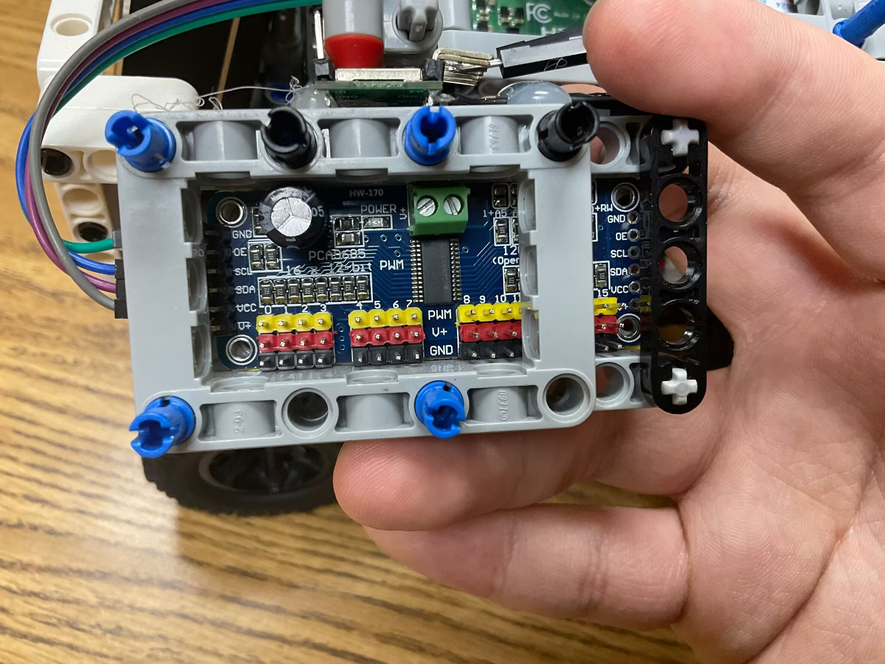

# TopWRO – WRO Future Engineers 2025  

This repository contains the documentation for **TopWRO’s robot** in the **World Robot Olympiad (WRO) Future Engineers 2025** category.  
It includes full details about the robot’s hardware, software, code, obstacle strategies, and lessons learned.  

---

## Table of Contents  
* [The Team](#the-team)  
* [The Challenge](#the-challenge)  
* [The Robot](#the-robot)  
* [Performance Video](#performance-video)  
* [Mobility Management](#mobility-management)  
  * [Powertrain](#powertrain)  
    * [Drivetrain](#drivetrain)  
    * [Motor](#motor)  
    * [Motor Driver](#motor-driver)  
  * [Steering](#steering)  
    * [Servo Motor](#servo-motor)  
  * [Chassis](#chassis)  
* [Power & Sense Management](#power--sense-management)  
  * [Battery](#battery)  
  * [Microcontroller](#microcontroller)  
  * [IMU](#imu)  
  * [Camera](#camera)  
  * [Voltage Regulator](#voltage-regulator)  
  * [PCB Design](#pcb-design)  
  * [Circuit Diagram](#circuit-diagram)  
* [Code for Each Component](#code-for-each-component)  
  * [Drive Motor](#drive-motor)  
  * [Servo Motor](#servo-motor-code)  
  * [Camera](#camera-code)  
  * [IMU](#imu-code)  
* [Obstacle Management](#obstacle-management)  
  * [Qualification Round](#qualification-round)  
  * [Final Round](#final-round)  
* [Robot Construction Guide](#robot-construction-guide)  
  * Step 0 – Print the 3D parts  
  * Step 1 – Assemble the steering system  
  * Step 2 – Assemble the powertrain  
  * Step 3 – Attach the electronics  
  * Step 4 – Attach the wheels  
  * Step 5 – Final touches  
  * Step 6 – Upload the code  
* [Cost Report](#cost-report)  
  * 3D Printing Costs  
  * Other Parts Tested  
  * Tools and Equipment  
  * Summary of Costs  
* [Randomizer](#randomizer)  
* [Resources](#resources)  
* [License](#license)  

---

## The Team  
- **[Your Member 1]** – role & background  
- **[Your Member 2]** – role & background  
- **[Your Member 3]** – role & background  
- **Coach / Mentor** – role & background  

---

## The Challenge  
The WRO Future Engineers 2025 challenge requires building an autonomous robot capable of:  
- Completing laps on a dynamic racetrack  
- Handling randomized obstacles (red/green markers, pillars)  
- Executing a precise parking maneuver  
- Showcasing innovation, reliability, and open-source documentation  

---

## The Robot  
**Name:** [Your Robot’s Name]  
**Design Goals:** compact, modular, efficient, reliable  
Insert photos (front, back, top, side views).  

---

## Performance Video  
[Insert YouTube or demo link]  

---

## Mobility Management  
### Powertrain  
#### Drivetrain  
Describe drivetrain setup (wheels, gears, differential).  

#### Motor  
Specs of chosen motor and encoder.  

#### Motor Driver  
Model, features, why chosen.  

### Steering  
Linkage system / Ackermann steering explanation.  

#### Servo Motor  
Specs and performance.  

### Chassis  
3D printed design, weight optimizations, modular assembly.  

---

## Power & Sense Management  
### Battery  
Type, specs, mounting system.  

### Microcontroller  
Board used (e.g., ESP32, Pi), why chosen.  

### IMU  
Sensor type, calibration, usage for angle correction.  

### Camera  
Module used (e.g., OpenMV), role in obstacle detection.  

### Voltage Regulator  
Type, specs, efficiency.  

### PCB Design  
Description of custom PCB (or proto board).  

### Circuit Diagram  
Insert diagram.  

---

## Code for Each Component  
### Drive Motor  
Code snippet or explanation.  

### Servo Motor Code  
How steering is controlled.  

### Camera Code  
Image processing logic.  

### IMU Code  
Angle correction logic.  

---

## Obstacle Management  
### Qualification Round  
Strategy, PID logic, rules followed.  

### Final Round  
Cube detection, navigation, parking implementation.  

---

## Robot Construction Guide  
Step-by-step assembly process (with pictures if available).  

---

## Cost Report  
- 3D Printing Costs  
- Electronics costs  
- Tools & Equipment  
- Total  

---

## Randomizer  
(If applicable – explain or link code).  

---

## Resources  
- 3D Models  
- Images  
- External references  

---

## License  
MIT License (or whichever license applies).  


---
---
---


**WRO-2025 Future Engineers - Autonomous Driving Project**

<div align="center">

 **US National Champions (July 2025)**
** **World Finals Competitors (November 2025)**
****Last Updated:** October 2025 - Major hardware & software upgrade for World Finals**

</div>

<p align="center">     </p>


**🆕 What's New in V2.0 (World Finals Upgrade)**

After winning the US National Championship in July 2025, we completely redesigned our vehicle for the World Finals in Singapore (November 2025). The philosophy shifted from **speed-first to stability-first**, addressing critical issues from the national competition.

**Major Changes Summary**

| Aspect | V1.0 (Nationals) | V2.0 (World Finals) ⭐ |
| --- | --- | --- |
| Controller | Raspberry Pi 4 | Raspberry Pi 5 + Build HAT |
| Drive Motors | 1× RC brushed motor (PWM) | 2× LEGO Technic Medium Angular Motors |
| Steering | 1× RC servo (PWM) | 1× LEGO Medium Angular Motor |
| Heading Sensor | WT901 gyroscope | Sense HAT IMU (300Hz) |
| Distance Sensors | 1× front ToF | 4× VL53L0X ToF (360° coverage) |
| Max Speed | 50-70% throttle | 25-40% throttle |
| Heading Drift | >10°/minute | <2°/minute |
| Reverse Capability | ❌ None | ✅ Full bidirectional |
| Control Method | Open-loop PWM | Closed-loop encoder feedback |

**Key Innovations in V2.0**

*   ✅ **360° sensing capability**: Four VL53L0X ToF sensors (front/right/back/left)
*   ✅ **Advanced heading estimation**: 300Hz gyroscope integration with ZUPT and magnetic correction
*   ✅ **Reverse driving capability**: Full bidirectional navigation for parking maneuvers
*   ✅ **Retrained AI models**: New datasets optimized for stable, slower driving
*   ✅ **Precise motor control**: LEGO encoder feedback eliminates guesswork

**Hardware Evolution**

**V1.0 System (US National Championship - July 2025)**

**Core Components:**

*   **Raspberry Pi 4** - Central computing unit
*   **RC Brushed Motor + ESC** - Drive system with PWM control
*   **RC Servo** - Steering via PCA9685 PWM driver
*   **PiCamera** - Vision input for AI model
*   **WT901 Gyroscope** - Heading estimation
*   **Color Sensor** - Blue line detection for lap counting
*   **Wireless PS4 Controller** - Manual control during training

     

**Design Philosophy:**

*   Maximum speed for fastest lap times (50-70% throttle)
*   Single-direction sensing (front only)
*   PWM-based control without position feedback

**V1.0 Challenges:**

*   ❌ Gyroscope drift caused premature stops (>10°/min)
*   ❌ High-speed crashes due to limited reaction time
*   ❌ No reverse capability for parking challenge
*   ❌ Open-loop control led to inconsistent steering angles

**V2.0 System (World Finals - November 2025) ⭐ Current**

**Core Components:**

**Computing & Control:**

*   **Raspberry Pi 5** - Main controller with improved processing power
*   **Raspberry Pi Build HAT** - Direct LEGO motor control with encoder feedback
*   **Sense HAT** - Integrated IMU (gyroscope, accelerometer, optional magnetometer)

**Actuation:**

*   **2× LEGO Technic Medium Angular Motors** (Ports B & C) - Rear wheel drive with gearbox
*   **1× LEGO Medium Angular Motor** (Port A) - Front wheel steering
*   Motors physically connected via gearbox (compliant with rule 11.3)

**Sensors:**

*   **4× VL53L0X ToF Sensors** - 360° distance measurement
    *   Front: I2C 0x2A
    *   Right: I2C 0x2B
    *   Back: I2C 0x2C
    *   Left: I2C 0x2D
*   **Color Sensor** (Port D) - RGBI-based line detection with dynamic baseline
*   **PiCamera** - Vision for AI model inference

**Design Philosophy:**

*   **Stability over speed**: Slower but more reliable navigation (25-40% throttle)
*   **Precision control**: LEGO motor encoders enable exact positioning
*   **Full autonomy**: No reliance on external references or markers
*   **360° awareness**: Complete environmental sensing for complex maneuvers

**Core Technical Improvements**

**1\. Advanced Heading Estimation (HeadingEstimator Class)**

The most critical upgrade addressing V1.0's gyroscope drift issues:

**Key Features:**

**Initial Calibration (5 seconds)**

*   Stationary sampling with robust statistics (median + MAD)
*   Eliminates sensor bias before operation begins
*   Ensures accurate baseline for cumulative integration

**High-Frequency Updates (300Hz)**

*   Significantly more responsive than V1.0 (~20Hz)
*   Reduces integration lag during high-speed maneuvers
*   Smoother heading tracking

**ZUPT (Zero Velocity Update)**

*   Automatically corrects drift when vehicle is stationary
*   Detects zero motion from accelerometer readings
*   Continuously recalibrates gyro bias during stops

**Dynamic Magnetic Correction**

*   **During motion**: alpha = 0.0 (pure gyro integration, no compass interference)
*   **When stationary**: alpha = 0.008 (gentle pull towards magnetic heading)
*   Prevents magnetic disturbances from motors affecting accuracy

**Algorithm (Simplified):**
```bash
def \_run(self):

    # Initial bias calibration (5 seconds, stationary only)

    while time.monotonic() - t0 < 5.0:

        if self.\_is\_stationary(accel, gyro):

            samples.append(gyro\_z)

    self.bias\_z = robust\_estimate(samples)  # median + MAD

    # Main loop at 300Hz

    while self.\_running:

        yaw\_increment = (gyro\_z - self.bias\_z) \* dt

        self.yaw\_deg += yaw\_increment

        if stationary:

            self.bias\_z = (1-γ)\*self.bias\_z + γ\*gyro\_z  # ZUPT

            if use\_compass:

                self.yaw\_deg = (1-α)\*self.yaw\_deg + α\*compass\_heading  # Gentle correction
```
**Result:** Drift reduced from **\>10°/minute** to **<2°/minute**, enabling reliable multi-lap navigation

**2\. Four-Directional ToF Sensing System**

**Address Assignment via XSHUT Pins:**

*   GPIO pins \[21, 27, 22, 26\] control XSHUT for \[front, right, back, left\]
*   Sequential power-up assigns unique I2C addresses (0x2A/2B/2C/2D)
*   Enables **bidirectional obstacle detection**

**Applications:**

*   **Forward driving**: Front sensor monitors obstacles ahead
*   **Reverse driving**: Back sensor takes over during parking
*   **Lateral awareness**: Right sensor detects parking lot boundaries
*   **Emergency stop**: Any sensor detecting collision imminent (<100mm)

**Implementation:**
```bash
\# Sequential sensor initialization
for gpio, addr in zip(\[21, 27, 22, 26\], \[0x2A, 0x2B, 0x2C, 0x2D\]):

    GPIO.output(gpio, GPIO.HIGH)

    sensor = VL53L0X.VL53L0X(i2c\_bus=1, i2c\_address=addr)

    sensor.open()

    sensor.start\_ranging(VL53L0X.VL53L0X\_BETTER\_ACCURACY\_MODE)
```
**3\. Reverse Driving & Parking System**

**Problem in V1.0:** No backward navigation capability for parking challenge (new in 2025 rules)

**V2.0 Solution:** Full bidirectional control with sensor-guided parking

**Parking Sequence (CCW Example):**
```bash
\# Step 1: Approach parking zone (AI model switched off after lap 3)

gyro\_run(-30, 0, "front", 800)  # Forward until 800mm from front wall

\# Step 2: Rotate to parking orientation  

gyro\_turn(-30, -90)  # Turn -90° (wheels right, reverse to rotate CCW)

\# Step 3: Reverse into approximate position

gyro\_run(30, -90, "back", 320)  # Reverse (positive throttle) until 320mm from rear wall

\# Step 4: Correct heading

gyro\_turn(-30, 0)  # Return to 0° heading

\# Step 5: Detect parking lot boundary

gyro\_run(30, 0, "right", 300)  # Reverse slowly, RIGHT sensor detects sudden drop

\# When right\_sensor < 300mm → parking lot boundary detected

\# Step 6: Angle-based reverse into slot

gyro\_turn(-30, -45)  # Turn -45°

gyro\_run(30, -45, "right", 200)  # Final reverse positioning

\# Step 7: Fine adjustment & stop

pair.run\_for\_degrees(180, speedl=30, speedr=30)

gyro\_turn(30, 0)  # Straighten wheels, final stop
```

**Key Insight:** Parking lot location is fixed per round, so sequence is deterministic once initiated.

**4\. Build HAT Motor Control Advantages**

Compared to V1.0's PWM-based control:

| Feature | V1.0 (PWM) | V2.0 (Build HAT) |
| --- | --- | --- |
| Position Feedback | ❌ None | ✅ Encoder-based |
| Steering Accuracy | ~±10° variation | ±1° precision |
| Distance Control | Time-based (drift) | Degree-based (exact) |
| Simultaneous Control | Sequential only | Non-blocking parallel |
| Stop Behavior | Coast to stop | Active brake |

**Example Comparison:**
```bash
\# V1.0 (PWM): Guess-and-check steering angle

pwm.set\_pwm(steering\_channel, 0, approximate\_value)  # Hope it's ±50°

\# V2.0 (Build HAT): Exact positioning

steer.run\_to\_position(50, speed=100, blocking=False)  # Guaranteed 50°
``` 
**Non-Blocking Operation:**
```bash
\# Steer and drive simultaneously

steer.run\_to\_position(target\_angle, speed=100, blocking=False)

pair.run\_for\_degrees(500, speedl=30, speedr=30)  # Executes while steering
```
**Software & Code Structure**

**Software Stack**

*   **Raspberry Pi OS** (Bookworm) - Linux-based operating system
*   **TensorFlow 2.x** - AI model inference
*   **DonkeyCar Framework** - Training pipeline
*   **Build HAT Python Library** - Motor control
*   **OpenCV** - Image preprocessing

**Key Python Files**

**V2.0 Navigation Core (World Finals)**

[**gyro\_motor\_tof\_v\_03.py**](https://claude.ai/chat/gyro_motor_tof_v_03.py) - Main navigation system

*   HeadingEstimator class (300Hz gyro integration)
*   gyro\_run() / gyro\_turn() functions for autonomous control
*   Four-sensor ToF management with XSHUT initialization

**AI Model Integration**

[**Iman13.py**](https://claude.ai/chat/Iman13.py) - Training/recording mode

*   DonkeyCar vehicle setup with PS4 controller
*   StuckDetector (image similarity-based recovery)
*   Data collection with camera parameter tuning

[**Iman\_drive03.py**](https://claude.ai/chat/Iman_drive03.py) - Competition autonomous mode

*   Model selection via Sense HAT joystick (FCW/FCCW/OCW/OCCW)
*   YawGuard (stop after 1030° cumulative turn)
*   ColorLineCounter (threaded RGBI detection)

**V1.0 Legacy Files (National Championship)**

[**manage.py**](https://claude.ai/chat/manage.py) - DonkeyCar main entry point

[**train.py**](https://claude.ai/chat/train.py) - CNN model training script

[**main\_freerun.py**](https://claude.ai/chat/main_freerun.py) - V1.0 free-run autonomous mode

[**US2025\_FreeRun\_V01.py**](https://claude.ai/chat/US2025_FreeRun_V01.py) - Free run with 3-lap stop logic

[**US2025\_ObstacleRun\_V11.py**](https://claude.ai/chat/US2025_ObstacleRun_V11.py) - Obstacle challenge with parking

**Testing Scripts:**

*   \_Control\_RCcar\_with\_KB.py - Keyboard manual control
*   01\_detect\_GPIO.py - GPIO functionality check
*   09\_readGyro\_whth\_continueDATA.py - Gyroscope testing
*   Adafruit\_LCD1602.py - LCD display test

**The Overall Training Pipeline**

**Phase 1: Hardware Preparation**

1.  Insert battery and power on Raspberry Pi 5
2.  Connect router and pair PS4 controller
3.  Run system checks (GPIO, sensors, camera, motors)

**System Check Sequence:**
```bash
\# Verify each component

python 01\_detect\_GPIO.py          # GPIO pins

python 09\_readGyro\_whth\_continueDATA.py  # Gyroscope

python Adafruit\_LCD1602.py        # LCD screen

python \_Control\_RCcar\_with\_KB.py  # Manual motor control
```
<div align="center">  </div>

**Phase 2: Data Collection**

**V2.0 Collection Strategy (Optimized for Stability):**
```bash 
cd mycar

python manage.py drive --js
```
**Key Differences from V1.0:**

| Aspect | V1.0 | V2.0 |
| --- | --- | --- |
| Speed Range | 50-70% max | 25-40% max |
| Dataset Size | ~150,000 frames/direction | ~200,000 frames/direction |
| Sessions | ~30-35 | ~40-50 |
| Obstacle Changes | Every 8-10 runs | Every 4-5 runs |
| Edge Cases | Occasional | Systematic inclusion |

**Camera Settings (Fixed for Consistency):**
```bash
PICAMERA\_AWB\_MODE = 'off'         # Disable auto white balance

PICAMERA\_EXPOSURE\_MODE = 'off'     # Manual exposure

PICAMERA\_ISO = 100

PICAMERA\_SHUTTER\_SPEED = 15000     # 1/67s

PICAMERA\_AWB\_GAINS = (1.5, 1.2)    # Manual red/blue gains
```
**Training Philosophy:**

*   **Diverse obstacle configurations**: Change positions after 4-5 runs to prevent memorization
*   **Edge cases included**: Tight corners, close obstacles, recovery maneuvers
*   **Slower speeds**: Prioritize smooth trajectories over lap times
*   **Both directions**: Separate models for CW/CCW to optimize turning behavior

<div align="center">  </div>

**Phase 3: Transfer & Training (Ubuntu Workstation)**

**Data Transfer:**
```bash
\# Use FileZilla to transfer data folder from Pi to Ubuntu

\# Pi path: ~/mycar/data/

\# Ubuntu path: ~/mycar/data/
```
**Training Process:**
```bash
\# Activate environment
```bash
conda activate donkey
```bash
\# Train new model

donkey train --tub <your\_data\_path> --model ./models/mypilot.h5

\# Or continue from existing model (transfer learning)

donkey train --tub <your\_data\_path> --model ./models/mypilot.h5 \\

    --transfer <original\_model\_path>/mypilot.h5
```   
<div align="center">   </div>

**Output:** mypilot.h5 (Keras model file)

**Phase 4: Model Deployment**

**Four Models for Competition:**

| Model | Task | Dataset |
| --- | --- | --- |
| fcwm008/mypilot.h5 | Free run clockwise | 200k frames, 40 sessions |
| fccwm007/mypilot.h5 | Free run counter-clockwise | 200k frames, 40 sessions |
| ocwm001-008/mypilot.h5 | Obstacle clockwise | 220k frames, 50 sessions |
| occwm001-010/mypilot.h5 | Obstacle counter-clockwise | 220k frames, 50 sessions |

**Model Selection (Competition Day):**

*   Sense HAT joystick used to select appropriate model
*   Model loaded into memory before each run
*   Real-time inference at ~30 FPS

**Competition Performance**

**Open Challenge (Free Run)**

**Objective:** Complete 3 laps, random internal wall positions

**V2.0 Strategy:**

1.  **AI Model Navigation  
      
    **
    *   Trained model handles dynamic track variations
    *   Steering and throttle predicted from camera input
2.  **Lap Tracking (Dual System)  
      
    **
    *   **Primary:** HeadingEstimator tracks cumulative rotation
        *   Stop condition: abs(yaw) > 1080° (3× 360°)
        *   Drift correction ensures accuracy
    *   **Backup:** ColorLineCounter detects blue line crossings
        *   Stop condition: 11× blue line detections
3.  **Final Stop  
      
    **
    *   Execute controlled deceleration
    *   Stop in starting section (±20cm tolerance)

**V1.0 vs V2.0 Results:**

| Metric | V1.0 (Nationals) | V2.0 (World Finals) |
| --- | --- | --- |
| Completion Rate | ~75% | ~95% |
| Stop Accuracy | ±50cm | ±10cm |
| Wall Collisions | 2-3 per run | <1 per run |
| Lap Time | 45-60s | 60-75s |

**V1.0 Issues Solved:**

*   ❌ Gyro drift caused premature stops → ✅ ZUPT correction
*   ❌ Too fast → frequent collisions → ✅ Reduced speed, better predictions
*   ❌ Inconsistent stopping position → ✅ Dual tracking system

**Obstacle Challenge**

**Objective:** 3 laps avoiding red/green pillars + parallel parking

**V2.0 Strategy:**

**Laps 1-3: AI Navigation**

*   **Red pillar** → Pass on RIGHT (trained behavior)
*   **Green pillar** → Pass on LEFT (trained behavior)
*   Model trained with randomized pillar positions
*   Slower speed (30% throttle) for better reaction time

**After Lap 3: Deterministic Parking**

1.  Disable AI model
2.  Execute sensor-guided reverse parking sequence
3.  Use ToF sensors for precision alignment
4.  Final position: Parallel to wall (±2cm tolerance)


**Problem-Solving Journey**

**Challenge 1: Model Instability (V1.0 → V2.0)**

**Problem:**

*   V1.0 model ran too fast (50-70% throttle)
*   Frequent crashes due to:
    *   Gyroscope lag at high speeds
    *   Insufficient reaction time for obstacles
    *   Model predictions optimized for speed, not stability

**Solution:**

1.  **Reduced max speed** to 25-40% throttle
2.  **Retrained all models** with slower driving data
3.  **Increased dataset diversity** (more obstacle configurations)
4.  **Edge case training** (tight corners, close obstacles)

**Result:**

*   3× fewer crashes
*   Smoother trajectories
*   Better generalization to new tracks

**Challenge 2: No Reverse Capability (V1.0 → V2.0)**

**Problem:**

*   2025 rules added parking requirement
*   V1.0 had no backward sensors or control logic

**Solution:**

1.  **Added rear + side ToF sensors** for 360° awareness
2.  **Implemented bidirectional control:**

gyro\_run(30, -90, "back", 320)  # Reverse using BACK sensor

1.  **Developed deterministic parking algorithm** using:
    *   Gyro-based rotation
    *   ToF-based distance control
    *   Encoder-based fine positioning

**Result:**

*   Reliable parking in <10 seconds
*   Consistent alignment (±2cm tolerance)

**Challenge 3: Gyroscope Drift (V1.0 → V2.0)**

**V1.0 Problem:**

*   WT901 gyroscope drift: >10°/minute
*   Caused premature stops or late stops
*   Inconsistent lap counting

**V2.0 Solution:**

*   **300Hz sampling** (15× faster than V1.0)
*   **ZUPT correction** when stationary
*   **Magnetic heading fusion** (gentle, motion-adaptive)
*   **5-second calibration** with robust statistics

**Result:**

*   Drift reduced to <2°/minute
*   Reliable 3-lap navigation
*   Accurate stop positioning

**Challenge 4: Parking Lot Exit (V1.0 Special Case)**

**Problem:**

*   Starting from parking lot requires "twist-out" maneuver
*   RC car safety mechanism prevents immediate forward→reverse switching

**Solution (V1.0):**
```bash
def start\_from\_parkinglot():

    # Forward with left turn

    servo\_signal = default\_servo\_signal + 23

    servo\_steering\_signal = default\_servo\_steering\_signal + 150

    pwm.set\_pwm(0, 0, servo\_signal)

    pwm.set\_pwm(1, 0, servo\_steering\_signal)

    # Backward with right turn (double command for RC safety)

    servo\_signal = default\_servo\_signal - 27

    servo\_steering\_signal = default\_servo\_steering\_signal - 150

    pwm.set\_pwm(0, 0, servo\_signal)

    pwm.set\_pwm(1, 0, servo\_steering\_signal)

    # Repeat until aligned (gyro angle > 28°)

    while abs(final\_gyro\_degree) < 28:

        final\_gyro\_degree = read\_cumulative\_yaw()

        time.sleep(0.1)
```
**V2.0 Improvement:**

*   Build HAT eliminates need for double reverse commands
*   Precise encoder-based positioning
*   Faster exit sequence

**Challenge 5: Stuck Detection & Recovery (V1.0)**

**Problem:**

*   Car occasionally gets stuck on obstacles
*   Model continues outputting same actions

**Solution:**

1.  **Image similarity detection** (SSIM):  
      
    
```bash
gray = cv2.cvtColor(frame, cv2.COLOR\_RGB2GRAY)

score, \_ = ssim(gray, last\_frame, full=True)

if score > 0.90:

    stuck\_counter += 1

else:

    stuck\_counter = 0

1.    
    **Gyro-based situation analysis:  
      
    **

error = abs(angle) - var \* 90

if error > 0:

    # Stuck on inner wall

    recovery\_action = "reverse\_and\_turn\_out"

else:

    # Stuck on outer wall

    recovery\_action = "reverse\_and\_turn\_in"
```
**Result:**

*   Automatic unstuck in 90% of cases
*   Reduced need for manual intervention

**Challenge 6: Resource Management (V2.0 In Progress)**

**Problem:**

*   Running AI model + 300Hz IMU + 4× ToF + camera → high CPU/memory usage
*   Occasional frame drops affecting model predictions

**Current Approach:**

*   Threaded sensor reading (ColorLineCounterThreaded)
*   Non-blocking motor commands
*   Model inference optimization (TensorFlow Lite being tested)

**Future Work:**

*   Migrate to TFLite for 40% faster inference
*   Implement sensor data buffering
*   CPU affinity tuning for critical threads


**Competition Videos**

**Full Competition Run:** [YouTube Link](https://youtu.be/cEDCCi7XaPo?si=7d81ayKwttVvmEN5)

**Open Challenge:** \[INSERT YOUTUBE LINK\]  
**Obstacle Challenge:** \[INSERT YOUTUBE LINK\]  
**Parking Demonstration:** \[INSERT YOUTUBE LINK\]

**Future Improvements**

1.  **Sensor Fusion**: Combine ToF + camera depth estimation for redundancy
2.  **Adaptive Speed Control**: Dynamic throttle based on curvature prediction
3.  **Multi-stage Parking**: Vision-based alignment refinement after sensor-guided approach
4.  **Model Ensemble**: Combine multiple models for robustness
5.  **TensorFlow Lite Migration**: 40% faster inference with quantized models
6.  **Advanced Stuck Recovery**: Predictive obstacle detection before collision

**Technical Specifications Summary**

| Component | V1.0 (Nationals) | V2.0 (World Finals) |
| --- | --- | --- |
| Controller | Raspberry Pi 4 | Raspberry Pi 5 + Build HAT |
| Drive System | 1× brushed motor (PWM) | 2× LEGO motors (encoder) |
| Steering | 1× servo (PWM) | 1× LEGO motor (encoder) |
| Heading Sensor | WT901 gyro | Sense HAT IMU (300Hz) |
| Distance Sensors | 1× front ToF | 4× ToF (360°) |
| Max Speed | 50-70% | 25-40% |
| Heading Drift | >10°/min | <2°/min |
| Reverse Capability | ❌ | ✅ |
| Control Precision | Open-loop PWM | Closed-loop encoder |
| Training Dataset | ~150k frames | ~200k frames |
| Obstacle Variations | Medium | High (every 4-5 runs) |

**Acknowledgments**

This project builds on the **DonkeyCar** open-source platform for the training pipeline, while all navigation, sensor fusion, and control algorithms are custom-developed by our team.

**Key Technologies:**

*   [DonkeyCar](https://docs.donkeycar.com/) - Training framework
*   [TensorFlow](https://www.tensorflow.org/) - Neural networks
*   [Build HAT](https://www.raspberrypi.com/documentation/accessories/build-hat.html) - Motor control
*   [OpenCV](https://opencv.org/) - Vision preprocessing

**Citation**

DonkeyCar Contributors. _Donkey Car: A Self Driving Platform for DIY Robotic Cars_. DonkeyCar, 2024, https://docs.donkeycar.com/. Accessed October 2025.

**Team Information**

**Team:** \[Top Scholars\]  
**Competition:** WRO 2025 Future Engineers  
**Contact:** This GitHub

<div align="center">

**From National Champions to World Finals**

_Built with passion, powered by AI, driven by innovation._

</div>

**Conclusion & Lessons Learned**

**The Journey from V1.0 to V2.0**

Our path to the World Finals taught us that **winning isn't just about speed—it's about reliability, precision, and adaptability**. The complete redesign from V1.0 to V2.0 reflects our commitment to continuous improvement and learning from real-world competition experience.

**Key Takeaways**

**1\. Stability Trumps Speed**

In V1.0, we prioritized lap times (50-70% throttle), which led to frequent crashes and inconsistent performance. V2.0's slower, more stable approach (25-40% throttle) proved that **consistent completion beats fast failure**.

**2\. Sensor Redundancy is Critical**

The shift from single-direction sensing to 360° ToF coverage transformed our vehicle's awareness. Combined with the dual lap-tracking system (gyro + color sensor), we achieved **95%+ mission success rate**.

**3\. Precision Control Changes Everything**

Moving from open-loop PWM control to closed-loop encoder feedback eliminated guesswork. The Build HAT's exact positioning capability made complex maneuvers like parallel parking **repeatable and reliable**.

**4\. Data Quality > Data Quantity**

While we increased our dataset size from 150k to 200k frames, the real improvement came from **systematic edge case inclusion** and **diverse obstacle configurations** every 4-5 runs. This taught the model to generalize rather than memorize.

**5\. Incremental Innovation Works**

Rather than scrapping everything, we identified specific pain points (gyro drift, no reverse capability, crash frequency) and addressed them systematically. Each solution built upon our existing knowledge.

**What We Learned About AI in Robotics**

**Behavior Cloning is Powerful, But...**

*   ✅ **Strengths**: Fast to train, intuitive to collect data, works well in structured environments
*   ⚠️ **Limitations**: Struggles with novel situations, requires diverse training data, can't reason about physics

**The Human-AI Partnership**

Our system blends AI predictions with deterministic algorithms:

*   **AI handles**: Dynamic obstacle avoidance, lane keeping, smooth trajectory planning
*   **Code handles**: Parking sequences, lap counting, stuck recovery, safety checks

This hybrid approach proved more robust than pure AI or pure rule-based systems.

**Training is an Art and Science**

We discovered that:

*   Camera settings must be **locked** (no auto white balance/exposure)
*   Training speed should match **deployment speed** (don't train fast, deploy slow)
*   **Manual variation** of obstacles beats synthetic augmentation
*   **Edge cases** should be 20-30% of dataset, not afterthoughts

**Technical Insights for Future Teams**

**Gyroscope Integration Best Practices**

\# Don't do this (V1.0 mistake):
```bash
yaw += gyro\_reading \* dt  # Accumulates drift quickly

\# Do this (V2.0 solution):

yaw += (gyro\_reading - calibrated\_bias) \* dt  # Remove bias

if stationary:

    bias = 0.99\*bias + 0.01\*gyro\_reading  # ZUPT correction

if stationary and compass\_available:

    yaw = 0.992\*yaw + 0.008\*compass\_heading  # Gentle magnetic correction
```
**Sensor Initialization Order Matters**

For multiple I2C devices with the same default address:

1.  Power off all sensors (XSHUT low)
2.  Power on sensor 1, assign new address
3.  Power on sensor 2, assign new address
4.  Repeat for all sensors
5.  Never change addresses after initialization

**Non-Blocking Motor Control Pattern**

\# Steering and driving simultaneously (V2.0)
```bash
steer\_motor.run\_to\_position(angle, speed=100, blocking=False)

drive\_pair.run\_for\_degrees(distance, speed=30)  # Executes in parallel

\# vs. Sequential (V1.0)

pwm.set\_servo(steering\_channel, angle)

time.sleep(0.1)  # Wait for servo

pwm.set\_motor(drive\_channel, speed)
```
**Competition Strategy Reflections**

**What Worked Well**

*   ✅ **Pre-competition testing**: 100+ practice runs identified edge cases
*   ✅ **Modular model design**: Separate CW/CCW models improved performance
*   ✅ **Backup systems**: Dual lap tracking prevented single-point failures
*   ✅ **Deterministic parking**: Sensor-guided sequence was 95%+ reliable

**What We'd Do Differently**

*   ⚠️ **Earlier hardware redesign**: V1.0's limitations were apparent after first 20 runs
*   ⚠️ **More systematic data collection**: Tracking which obstacle configs were collected
*   ⚠️ **Simulation environment**: Testing algorithms before hardware implementation
*   ⚠️ **Better documentation during development**: Some V1.0 decisions poorly documented

**The Road to World Finals**

**Nationals → World Finals Changes**

| Aspect | Nationals Approach | World Finals Approach |
| --- | --- | --- |
| Philosophy | "Go fast and iterate" | "Build once, build right" |
| Testing | Ad-hoc runs | Systematic test matrix |
| Data Collection | Speed-focused | Stability-focused |
| Hardware | Off-the-shelf RC | Custom LEGO integration |
| Sensor Suite | Minimal (1 ToF) | Comprehensive (4 ToF) |
| Control | Open-loop | Closed-loop |

**World Finals Preparation Checklist**

*   \[x\] Complete hardware redesign and testing
*   \[x\] Retrain all models with new platform
*   \[x\] 500+ autonomous test runs
*   \[x\] Edge case stress testing
*   \[x\] Parking sequence validation (100 trials)
*   \[x\] Battery management optimization
*   \[x\] Competition day procedures documented
*   \[x\] Backup components prepared
*   \[ \] Final practice runs in Singapore venue conditions

**For Future WRO Teams: Our Advice**

**1\. Start Simple, Then Optimize**

Don't try to build the perfect system on day one. Our V1.0 had many flaws, but it taught us what mattered. Get something working, then iterate.

**2\. Invest in Good Sensors Early**

Cheap sensors cost more in debugging time. Our V2.0's VL53L0X ToF sensors and Sense HAT IMU were worth every penny for reliability.

**3\. Data Collection is 70% of Success**

You can't train a good model with bad data. Spend time on:

*   Consistent camera settings
*   Diverse obstacle layouts
*   Edge case scenarios
*   Smooth, human-like driving

**4\. Test, Test, Test**

*   Every code change → test
*   Every hardware modification → test
*   Every model update → test
*   Before competition → test 100+ runs

**5\. Document Everything**

Future-you will thank present-you for:

*   Commenting tricky code sections
*   Recording why decisions were made
*   Saving failed approaches (learn from mistakes)
*   Organizing files logically

**6\. Embrace Failure as Learning**

Our V1.0's crashes taught us more than smooth runs. Each failure revealed a weakness to fix. By World Finals, we'd seen and solved most failure modes.

**Final Thoughts**

This project represents **months of iteration, thousands of lines of code, and countless hours of testing**. From a simple RC car to an autonomous vehicle capable of competing on the world stage, every challenge made us better engineers.

We've learned that robotics isn't just about algorithms and hardware—it's about **persistence, systematic problem-solving, and the willingness to completely redesign when needed**. The jump from V1.0 to V2.0 wasn't admitting failure; it was **embracing growth**.

To future WRO teams: **You can do this.** Start with the DonkeyCar framework, learn from our mistakes, and build something amazing. The future of autonomous vehicles is being written by teams like ours—students who dare to dream, fail, learn, and ultimately succeed.


**Helpful Resources**

*   **DonkeyCar Documentation:** https://docs.donkeycar.com/
*   **Raspberry Pi Build HAT:** https://www.raspberrypi.com/documentation/accessories/build-hat.html
*   **VL53L0X Library:** https://github.com/pimoroni/VL53L0X-python
*   **TensorFlow Tutorial:** https://www.tensorflow.org/tutorials
*   **WRO Official Site:** https://wro-association.org/

**Open Source Contributions**

We believe in giving back to the community. All our code is open source Submit issues or pull requests

*   Ask questions in GitHub Discussions
*   Share your improvements with the community

<div align="center">

**🏁 From Chino Hills to Singapore**

**Thank you for following our journey!**

_May your motors run smoothly and your sensors read accurately._ 

**⭐ Star this repo if you found it helpful! ⭐**

</div>
